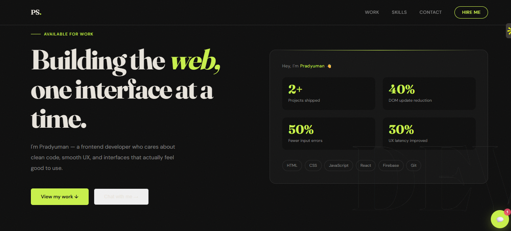
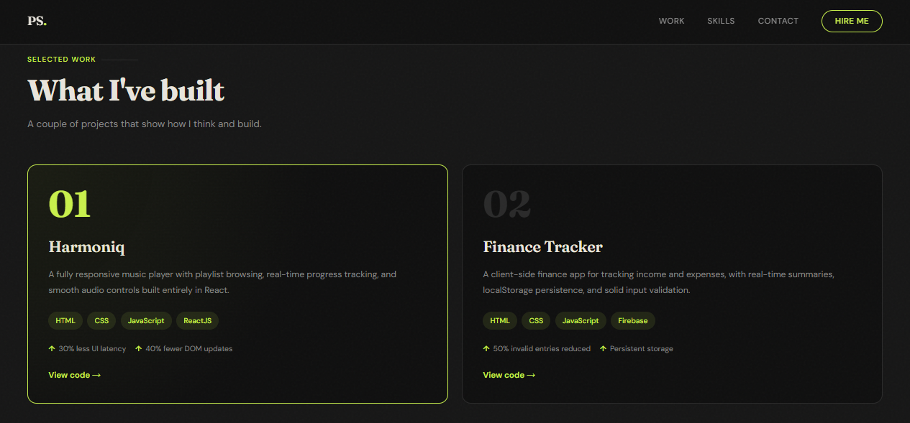
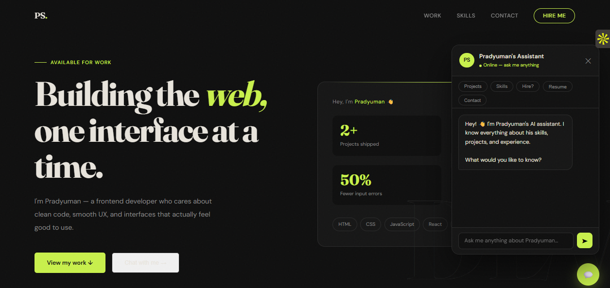
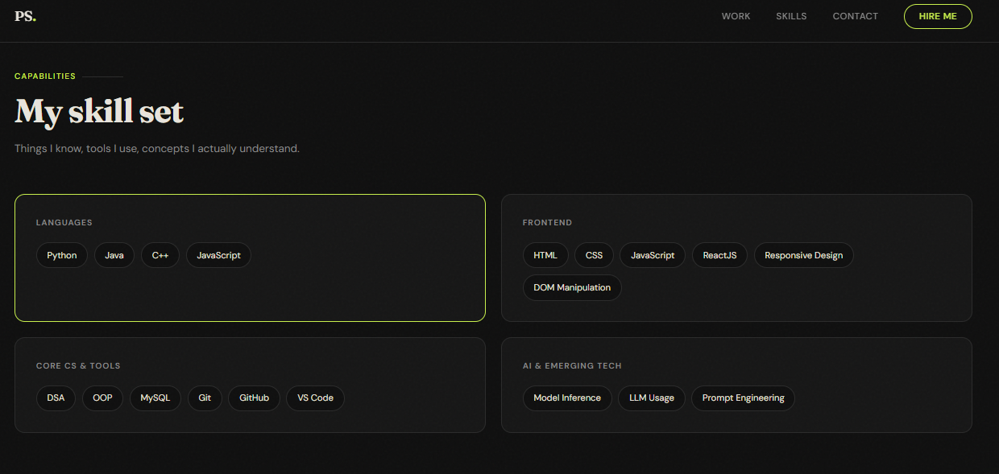
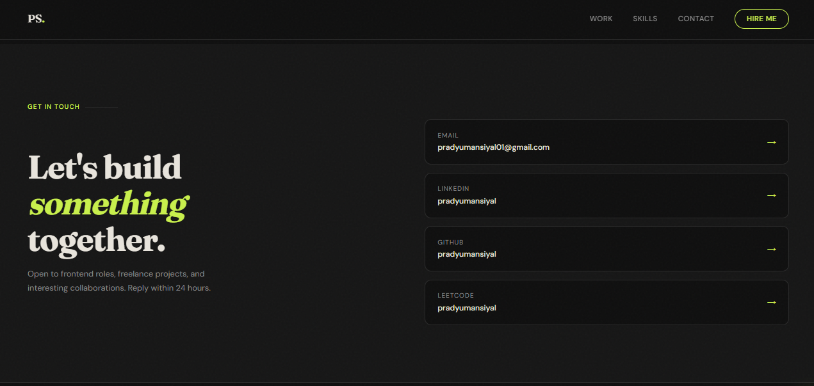

# Personal Portfolio Website — Pradyuman Siyal

A modern, responsive personal portfolio website built to showcase my frontend skills, projects, and professional profile.  
Designed with performance, clean UI, and recruiter experience in mind.

🌐 **Live Website:** http://pradyumansiyal.us.cc
📄 **Resume:** 
💼 **Role:** Frontend Developer  

---

## ✨ Overview

This portfolio is a single-page, fully responsive website that highlights:
- Who I am as a developer
- The projects I’ve built
- My technical skill set
- Easy ways for recruiters and collaborators to contact me

It also includes an **interactive AI chatbot** that answers common questions about my background, skills, projects, and availability.

---

## 🧠 Key Features

- **Modern UI/UX**
  - Clean typography and layout
  - Smooth hover states and micro-interactions
  - Dark theme with subtle visual accents

- **Responsive Design**
  - Optimized for desktop, tablet, and mobile screens
  - CSS Grid and Flexbox based layout

- **Interactive AI Chatbot**
  - Embedded assistant for recruiters
  - Answers questions about skills, projects, resume, and contact info
  - Quick action chips for common queries

- **Performance-Focused**
  - Minimal DOM updates
  - Optimized CSS and JavaScript
  - No heavy frameworks for faster load times

- **Simple & Maintainable**
  - Vanilla HTML, CSS, and JavaScript
  - Easy to customize and extend

---

## 🛠️ Tech Stack

**Frontend**
- HTML5
- CSS3
- JavaScript (ES6+)

**Design**
- Google Fonts (Fraunces, DM Sans)
- Custom CSS variables for theming

**Tools & Platform**
- Git & GitHub
- GitHub Pages (hosting)
- Cloudflare (domain & DNS)

---

## 📂 Project Structure
├── index.html # Main website structure
├── style.css # Styling and layout
├── script.js # Interactivity and chatbot logic
├── logo.png # Personal logo
├── resume.pdf # Resume (optional download)
├── CNAME # Custom domain configuration
└── README.md # Project documentation

## Screenshots

### Homepage

### Projects Section

### AI Chatbot

### Skills Section

### Contact Me Section

⭐ Acknowledgement

Built from scratch to reflect my frontend philosophy:
clean code, smooth UX, and practical design decisions.
